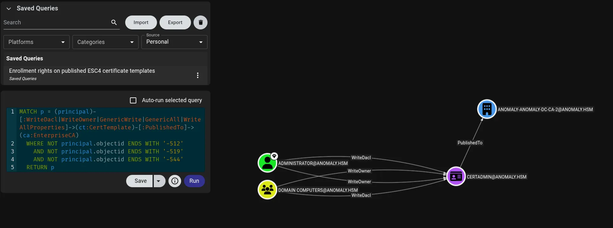
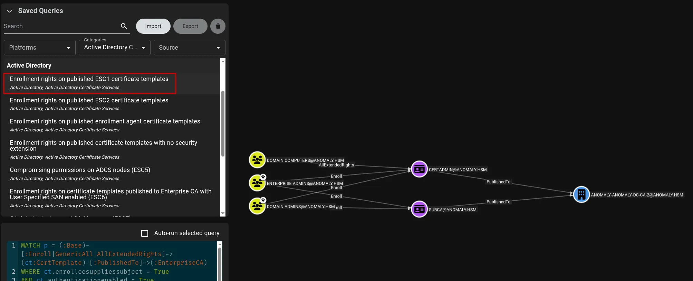

<h1 align="center">
  <br>
  CertiHound
  <br>
</h1>

<h4 align="center">Linux-native AD CS collector for BloodHound CE</h4>

<p align="center">
  <a href="https://pypi.org/project/certihound/">
    
  </a>
  <a href="https://pypi.org/project/certihound/">
    
  </a>
  <a href="https://github.com/0x0Trace/Certihound/blob/main/LICENSE">
    
  </a>
</p>

<p align="center">
  <a href="#features">Features</a> •
  <a href="#installation">Installation</a> •
  <a href="#quick-start">Quick Start</a> •
  <a href="#usage">Usage</a> •
  <a href="#bloodhound-integration">BloodHound</a> •
  <a href="#api-reference">API</a>
</p>

---

**CertiHound** enumerates Active Directory Certificate Services (AD CS) via LDAP and exports BloodHound CE-compatible data for attack path visualization. Identify ESC1-ESC17 vulnerabilities and visualize certificate-based attack paths.

## Screenshots

### ESC1 - Enrollee Supplies Subject Detection
<p align="center">
  
</p>

*CertiHound detects ESC1 vulnerable templates and creates enrollment edges to Enterprise CAs, enabling attack path analysis in BloodHound CE.*

### ESC4 - Template ACL Abuse Detection
<p align="center">
  
</p>

*WriteDacl, WriteOwner, and other dangerous permissions on certificate templates are identified and mapped as attack edges.*

---

## Features

| Feature | Description |
|---------|-------------|
| **Linux-Native** | No Windows dependencies - pure Python LDAP enumeration |
| **BloodHound CE v6+** | Direct JSON/ZIP import with full node and edge support |
| **Vulnerability Detection** | ESC1-ESC11, ESC13-ESC17, GoldenCert |
| **Multiple Backends** | Works with ldap3, impacket, or any compatible LDAP adapter |
| **NetExec Integration** | Seamless integration with NetExec's `--bloodhound` option |
| **Comprehensive Coverage** | Certificate templates, Enterprise CAs, Root CAs, NTAuth, AIA CAs |

### Supported Vulnerabilities

| Vulnerability | Description |
|---------------|-------------|
| **ESC1** | Enrollee supplies subject with low-privilege enrollment |
| **ESC2** | Any Purpose EKU or no EKU allows enrollment agent abuse |
| **ESC3** | Enrollment agent templates + vulnerable targets |
| **ESC4** | Dangerous ACL permissions on certificate templates |
| **ESC5** | Vulnerable PKI object access control on AD containers |
| **ESC6** | EDITF_ATTRIBUTESUBJECTALTNAME2 on Enterprise CA |
| **ESC7** | Dangerous CA permissions (ManageCA / ManageCertificates) |
| **ESC8** | NTLM relay to AD CS web enrollment (HTTP) endpoints |
| **ESC9** | No security extension + weak certificate mapping |
| **ESC10** | Weak certificate mapping without strong binding |
| **ESC11** | NTLM relay to AD CS RPC endpoints (no encryption enforcement) |
| **ESC13** | Issuance policy with OID group link abuse |
| **ESC14** | Weak explicit certificate mappings (altSecurityIdentities) |
| **ESC15** | EKUwu - Application policy abuse on Schema V1 templates |
| **ESC16** | Security extension globally disabled on CA |
| **ESC17** | Server Authentication EKU + enrollee supplies subject (TLS MITM) |
| **GoldenCert** | CA private key extraction from hosting computer |

---

## Installation

### From PyPI (Recommended)

```bash
pipx install certihound
# Or, if you need Kerberos (-k) auth:
pipx install 'certihound[kerberos]'
# On an existing install, inject gssapi:
pipx inject certihound gssapi
```

### From Source

```bash
git clone https://github.com/0x0Trace/certihound.git
cd certihound
pip install -e .            # core
pip install -e '.[kerberos]' # with Kerberos support
```

### Verify Installation

```bash
certihound --version
certihound --help
```

---

## Quick Start

### Command Line

```bash
# Basic enumeration with password authentication
certihound -d corp.local -u 'user' -p 'password' --dc 10.10.10.10 -o output/

# Pass-the-Hash (NTHASH only, or LMHASH:NTHASH)
certihound -d corp.local -u 'user' -H :31d6cfe0d16ae931b73c59d7e0c089c0 --dc 10.10.10.10

# LDAPS (SSL/TLS) connection
certihound -d corp.local -u 'user' -p 'password' --dc 10.10.10.10 --ldaps -o output/

# Kerberos authentication (uses ccache; requires the 'kerberos' extra)
KRB5CCNAME=user.ccache certihound -d corp.local -k --dc dc01.corp.local -o output/

# Output as ZIP (default) or JSON
certihound -d corp.local -u 'user' -p 'password' --dc 10.10.10.10 --format zip
certihound -d corp.local -u 'user' -p 'password' --dc 10.10.10.10 --format json
```

### Python Library

```python
from certihound import ADCSCollector, BloodHoundCEExporter
from certihound.ldap.connection import LDAPConnection, LDAPConfig

# Configure connection
config = LDAPConfig(
    domain="corp.local",
    username="user",
    password="password",
    dc_ip="10.10.10.10",
    use_ldaps=True,
)

# Collect and export
with LDAPConnection(config) as conn:
    collector = ADCSCollector(conn)
    data = collector.collect_all()

    exporter = BloodHoundCEExporter(data.domain, data.domain_sid)
    result = exporter.export(data)
    result.write_zip("bloodhound_adcs.zip")
```

---

## Usage

### CLI Options

```
Usage: certihound [OPTIONS]

Options:
  -d, --domain TEXT         Target domain FQDN (e.g., corp.local)  [required]
  -u, --username TEXT       Username for authentication
  -p, --password TEXT       Password for authentication
  -H, --hashes TEXT         NTLM hash for pass-the-hash (LMHASH:NTHASH or NTHASH)
  --dc TEXT                 Domain Controller IP or hostname
  -k, --kerberos            Use Kerberos authentication (ccache)
  --ldaps                   Use LDAPS (SSL/TLS)
  --ca-cert PATH            CA certificate file for LDAPS validation
  --port INTEGER            LDAP port (default: 389 or 636 for LDAPS)
  -o, --output TEXT         Output directory (default: ./output)
  --format [json|zip|both]  Output format (default: zip)
  --enum-only               Only enumerate, skip vulnerability detection
  -v, --verbose             Increase verbosity (-v, -vv)
  --version                 Show the version and exit.
  --help                    Show this message and exit.
```

### Output Files

CertiHound generates BloodHound CE v6 compatible files:

| File | Description |
|------|-------------|
| `certtemplates.json` | Certificate template nodes with properties and edges |
| `enterprisecas.json` | Enterprise CA nodes with template publishing |
| `rootcas.json` | Root CA hierarchy nodes |
| `ntauthstores.json` | NTAuth store configuration |
| `aiacas.json` | AIA CA entries |

---

## BloodHound Integration

### Importing Data

1. Run CertiHound to generate the ZIP file
2. Open BloodHound CE
3. Click **Import** → Select the generated ZIP file
4. Use the built-in ADCS queries or create custom ones

### Example Cypher Queries

**Find ESC1 Vulnerable Templates:**
```cypher
MATCH p = (:Base)-[:Enroll|GenericAll|AllExtendedRights]->
(ct:CertTemplate)-[:PublishedTo]->(:EnterpriseCA)
WHERE ct.enrolleesuppliessubject = True
AND ct.authenticationenabled = True
RETURN p
```

**Find ESC4 Template ACL Abuse:**
```cypher
MATCH p = (principal)-[:WriteDacl|WriteOwner|GenericWrite|GenericAll|WriteAllProperties]->
(ct:CertTemplate)-[:PublishedTo]->(ca:EnterpriseCA)
WHERE NOT principal.objectid ENDS WITH '-512'
AND NOT principal.objectid ENDS WITH '-519'
AND NOT principal.objectid ENDS WITH '-544'
RETURN p
```

---

## NetExec Integration

CertiHound integrates with [NetExec](https://github.com/Pennyw0rth/NetExec) for ADCS enumeration.


```bash
# ADCS only collection
nxc ldap 10.10.10.10 -u user -p pass --bloodhound -c ADCS

# Full collection including ADCS
nxc ldap 10.10.10.10 -u user -p pass --bloodhound -c All --dns-server 10.10.10.10
```

## API Reference

### Core Classes

| Class | Description |
|-------|-------------|
| `ADCSCollector` | Main collector for ADCS enumeration |
| `BloodHoundCEExporter` | Exports data to BloodHound CE format |
| `ImpacketLDAPAdapter` | Adapter for impacket-based LDAP (NetExec) |
| `LDAPConnection` | Standalone LDAP connection wrapper |
| `LDAPConfig` | Configuration dataclass for LDAP connections |

### Data Models

| Class | Description |
|-------|-------------|
| `ADCSData` | Container for all collected ADCS data |
| `CertTemplate` | Certificate template with properties and ACLs |
| `EnterpriseCA` | Enterprise CA with enabled templates |
| `RootCA` | Root CA node |
| `NTAuthStore` | NTAuth certificate store |
| `AIACA` | AIA CA entry |
| `ExportResult` | Export result with `write_zip()`, `write_json()`, `to_dict()` |

### Detection Functions

```python
from certihound import (
    detect_esc1,
    detect_esc2,
    detect_esc3_agent,
    detect_esc3_target,
    detect_esc4,
    detect_esc5,
    detect_esc6,
    detect_esc7,
    detect_esc8,
    detect_esc9,
    detect_esc10,
    detect_esc11,
    detect_esc13,
    detect_esc14,
    detect_esc15,
    detect_esc16,
    detect_esc17,
)
```

### Usage Example

```python
from certihound import (
    ADCSCollector,
    BloodHoundCEExporter,
    ADCSData,
    ExportResult,
)

# Collect data
collector = ADCSCollector.from_external(adapter, domain, domain_sid)
data: ADCSData = collector.collect_all()

# Access collected objects
print(f"Templates: {len(data.templates)}")
print(f"Enterprise CAs: {len(data.enterprise_cas)}")
print(f"Root CAs: {len(data.root_cas)}")

# Export to BloodHound
exporter = BloodHoundCEExporter(data.domain, data.domain_sid)
result: ExportResult = exporter.export(data)

# Output options
result.write_zip("output.zip")      # ZIP for BloodHound import
result.write_json("output/")        # Individual JSON files
output_dict = result.to_dict()      # Python dictionary
```

---

## Dependencies

| Package | Purpose |
|---------|---------|
| `ldap3` | LDAP operations (standalone mode) |
| `impacket` | Kerberos authentication & NetExec integration |
| `cryptography` | Certificate parsing and analysis |
| `pydantic` | Data validation and models |
| `click` | CLI framework |
| `rich` | Terminal output formatting |

---

## License

This project is licensed under the MIT License - see the [LICENSE](LICENSE) file for details.

---

## Credits & References

- Inspired by [Certipy](https://github.com/ly4k/Certipy) by Oliver Lyak
- BloodHound CE format based on [BloodHound](https://github.com/SpecterOps/BloodHound) by SpecterOps
- ADCS vulnerability research: [Certified Pre-Owned](https://posts.specterops.io/certified-pre-owned-d95910965cd2) by Will Schroeder & Lee Christensen
